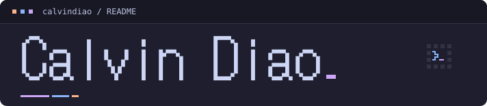

<picture>
  <source media="(prefers-color-scheme: dark)" srcset="./profile/header-mocha.svg">
  <source media="(prefers-color-scheme: light)" srcset="./profile/header-latte.svg">
  
</picture>

**Less clicking. More tinkering.**

Browser internals, immersive systems, and things I build.

<a href="https://chromium-review.googlesource.com/c/chromium/src/+/6707102">
  <picture>
    <source media="(prefers-color-scheme: dark)" srcset="./profile/chromium-mocha.svg">
    <source media="(prefers-color-scheme: light)" srcset="./profile/chromium-latte.svg">
    
  </picture>
</a>

**Google Summer of Code 2025** — [Structured DNS Error Support in Chromium's DNS Stack](https://chromium-review.googlesource.com/c/chromium/src/+/6707102).

### Selected work

- **[AR360 panoramic calling](https://techliker.com/ar-panoramic-calling/)** — Immersive video calls with Unity, Rokid and Insta360.
- **[Self-balancing motorcycle](https://techliker.com/smart-car-2021/)** — Sensor fusion, fuzzy PID and custom hardware. National second prize, 2021.
- **[Personal Codex skills](https://github.com/calvindiao/personal-codex-skills)** — Reusable development workflows across macOS, Windows and Linux.

### GitHub activity

<picture>
  <source media="(prefers-color-scheme: dark)" srcset="./profile/stats-mocha.svg">
  <source media="(prefers-color-scheme: light)" srcset="./profile/stats-latte.svg">
  
</picture>

Public GitHub repositories. Chromium contributions are tracked separately on [Gerrit](https://chromium-review.googlesource.com/q/owner:diaochenhao@gmail.com).

### Contribution trail

<picture>
  <source media="(prefers-color-scheme: dark)" srcset="./profile/snake-mocha.svg">
  <source media="(prefers-color-scheme: light)" srcset="./profile/snake-latte.svg">
  
</picture>

[Blog](https://techliker.com/) · [LinkedIn](https://www.linkedin.com/in/chenhaodiao/)

Catppuccin colors · [snk](https://github.com/Platane/snk) · [GitHub Readme Stats](https://github.com/anuraghazra/github-readme-stats), generated with its recommended [Action](https://github.com/stats-organization/github-readme-stats-action). Updated daily.
